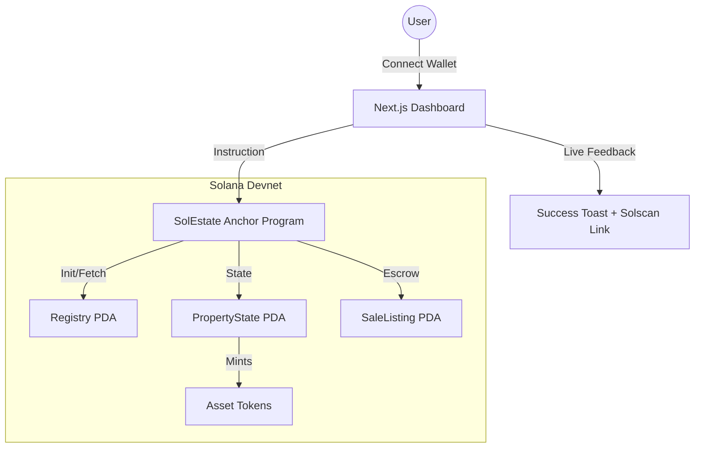

# 🏘️ SolEstate — Premium Fractional Real Estate Protocol on Solana

[](https://explorer.solana.com/?cluster=devnet)
[](https://www.anchor-lang.com/)
[](https://opensource.org/licenses/MIT)

**SolEstate** is a decentralized real estate investment protocol that democratizes ownership of high-value assets. By tokenizing properties into liquid SPL tokens, we remove the high-entry barriers of traditional markets, allowing anyone to own, trade, and earn yield from premium real estate starting with just 1 SOL.

---

## [Live Demo](https://payment-two-sable.vercel.app/) · [Demo Video](https://youtu.be/example) · [Docs](https://github.com/libitun/payment/blob/main/README.md) · [Solana Explorer](https://solscan.io/account/5tPSqDkPUP5sA56K25R2jN2sUrW57mf5m1b6QTPdRzYN?cluster=devnet)

## 🚀 Key Features

- **Fractional Ownership** — Assets are split into compliant SPL tokens. Own a beachfront villa for the price of a dinner.
- **P2P Secondary Market** — Instant liquidity. List your tokens for sale or buy from other investors in a trustless environment.
- **Glassmorphic Dashboard** — A state-of-the-art premium UI designed for visual excellence and clarity.
- **On-Chain Registry** — Every property is verified and stored in a decentralized Registry PDA for ultimate transparency.
- **Yield Boost Mechanics** — Lock your real estate tokens for fixed terms to earn higher annual yields.
- **Success Banners** — Real-time transaction feedback with direct Solscan links for every buy, list, or cancel action.

## 🛠️ Project Structure

```
/anchor
  └── /programs/solestate  — Rust · Anchor 0.30.1 smart contract
/app
  ├── /portfolio           — Next.js · User assets & P2P management
  └── /marketplace         — Next.js · Property discovery & investment
/lib
  ├── /p2p-market.ts       — Secondary market blockchain bridge
  └── /wallet-context.tsx  — Solana Wallet Adapter & IDL integration
```

## 📋 Versions & Requirements

```bash
rustc 1.75.0+
solana-cli 1.18.x+
anchor-cli 0.30.1
node 20.x+
next 14/15
```

## ⚡ Quick Start

### 1. Clone & Install
```bash
git clone https://github.com/libitun/payment.git
cd payment
npm install
```

### 2. Configure Environment
Create a `.env` in the root:
```env
NEXT_PUBLIC_SOLANA_NETWORK=devnet
NEXT_PUBLIC_PROGRAM_ID=5tPSqDkPUP5sA56K25R2jN2sUrW57mf5m1b6QTPdRzYN
```

### 3. Deploy Smart Contract (Optional)
```bash
cd anchor
anchor build
anchor deploy --provider.cluster devnet
```

### 4. Launch Dashboard
```bash
npm run dev
```
Open [http://localhost:3000](http://localhost:3000) to start investing.

---

## 🏗️ Architecture



## 📡 P2P Market Logic

The secondary market employs a secure escrow mechanism:
1. **List**: User creates a `SaleListing` PDA. Tokens move from the wallet to the `ListingVault` (escrow).
2. **Buy**: Purchaser sends SOL to the Seller. Tokens move from `ListingVault` to the Buyer.
3. **Cancel**: Seller reclaims tokens from the `ListingVault` and closes the `SaleListing` PDA.

---

## 🛡️ Security & Integrity

- **Program ID**: `5tPSqDkPUP5sA56K25R2jN2sUrW57mf5m1b6QTPdRzYN`
- **Ownership**: All funds are handled by the Solana System Program or the SPL Token Program via secure PDAs.
- **Permissions**: Only the registered owner of tokens can create or cancel secondary market listings.

---
*Built for the future of Real Estate on Solana.*